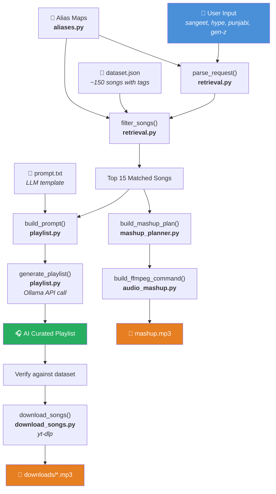
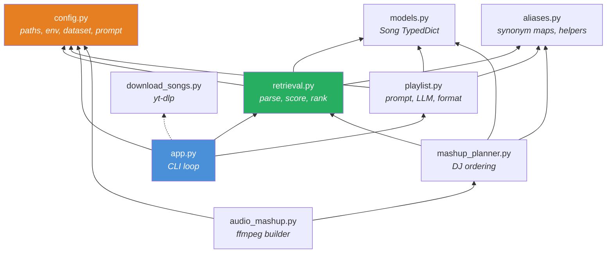

# ShaadiSetlist — Project Workflow

## What This Project Does

ShaadiSetlist is an AI-powered Indian wedding playlist curator. You tell it what wedding event you're planning (sangeet, baraat, haldi…), the vibe you want (hype, romantic, emotional…), and optionally a regional style and crowd type — and it returns a curated, DJ-ready playlist with downloadable MP3s.

It combines **local dataset retrieval** (no API calls) with a **local LLM** (Ollama) to produce playlists that are grounded in real song data rather than hallucinated.

---

## Architecture Overview



---

## Step-by-Step Flow

### Step 1 — User Input & Parsing

**File:** [retrieval.py](file:///Users/samarth/Desktop/shaadi-setlist/src/retrieval.py) → `parse_request()`

The user types something like:

```
sangeet, hype, punjabi, gen-z
```

`parse_request()` splits this into a structured dict:

```python
{
    "event": "sangeet",    # required
    "mood": "hype",        # required
    "region": "punjabi",   # optional
    "crowd": "gen-z",      # optional
}
```

It supports multiple input styles:
- **Comma-separated:** `sangeet, hype, punjabi, gen-z`
- **Space-separated:** `shaadi slow`
- **Named params:** `sangeet, hype, region=punjabi, crowd=family`

For the optional 3rd and 4th tokens, it auto-detects whether a word is a **region** or a **crowd** by checking it against the alias dictionaries.

---

### Step 2 — Alias Normalization

**File:** [aliases.py](file:///Users/samarth/Desktop/shaadi-setlist/src/aliases.py)

Indian weddings have many names for the same thing. The alias system maps variants to canonical keys:

| User types | Normalised to |
|---|---|
| `hype`, `energetic`, `upbeat`, `dance` | `high energy` |
| `shaadi`, `ceremony`, `pheras` | `wedding` |
| `baaraat`, `groom entry`, `procession` | `baraat` |
| `genz`, `gen z`, `young`, `friends` | `gen-z` |

`normalize(term, alias_map)` checks every alias list and returns the canonical key. This means user input like `"baraat, hype"` and `"baaraat, energetic"` produce identical results.

---

### Step 3 — Song Retrieval & Scoring

**File:** [retrieval.py](file:///Users/samarth/Desktop/shaadi-setlist/src/retrieval.py) → `filter_songs()`

This is the core ranking engine. For each of the ~150 songs in the dataset, it calculates a composite score:

```
Score breakdown:
├── Event match
│   ├── Exact match:    +4 points
│   ├── Primary tag:    +2 bonus (if it's the song's first event tag)
│   └── Partial match:  +1 point
├── Mood match
│   ├── Exact match:    +3 points
│   ├── Primary tag:    +1 bonus
│   └── Partial match:  +1 point
├── Region match (if specified)
│   ├── Exact match:    +2 points (checked across region + language + genre fields)
│   └── Partial match:  +1 point
└── Crowd match (if specified, and not "mixed")
    ├── Exact match:    +1 point
    └── Partial match:  +0.5 points
```

Songs are then sorted by three tiebreakers:
1. **Both event + mood exact match** (binary flag, most important)
2. **Total score** (higher is better)
3. **Energy fit** — a function that adjusts energy preference based on mood:
   - `emotional` moods prefer energy ≈ 3
   - `romantic` / `classy` moods prefer energy ≈ 5
   - Everything else prefers maximum energy

The top **15** songs are returned as full dict objects (not just names), so downstream consumers have all metadata.

---

### Step 4 — LLM Prompt Building

**File:** [playlist.py](file:///Users/samarth/Desktop/shaadi-setlist/src/playlist.py) → `build_prompt()`

The matched songs are formatted into structured metadata:

```
Available songs from the dataset:
1. Kala Chashma
   Energy: 10/10
   BPM: Unknown
   Genres: bollywood, punjabi
   Tags: cocktail, high energy, hype, reception, sangeet
2. Nagada Sang Dhol
   Energy: 10/10
   ...
```

This is injected into the [prompt template](file:///Users/samarth/Desktop/shaadi-setlist/data/prompt.txt), which instructs the LLM to act as an "elite Indian wedding DJ" and:
- Use **only** the provided songs
- Arrange them in a DJ flow with energy progression
- Explain why each song fits
- Suggest transitions between tracks
- Identify peak moments, best dance battle tracks, and singalong moments

---

### Step 5 — LLM Generation

**File:** [playlist.py](file:///Users/samarth/Desktop/shaadi-setlist/src/playlist.py) → `generate_playlist()`

The prompt is sent to a **local Ollama instance** (default model: `phi3`) via HTTP POST to `http://localhost:11434/api/generate`. The response is the AI-curated playlist with reasoning.

> [!IMPORTANT]
> This is entirely local — no OpenAI, no cloud API. The LLM runs on your machine via Ollama.

---

### Step 6 — Output Verification & Download

**File:** [app.py](file:///Users/samarth/Desktop/shaadi-setlist/src/app.py) → `_extract_verified_songs()`

The LLM might hallucinate song names or add formatting artefacts. The verification step:

1. **Parses** numbered lines from the LLM output (`1. Song Name`)
2. **Strips** markdown bold (`**`), prefixes (`Song Name:`), trailing annotations (`(Repeated)`, `- As we kick off...`)
3. **Cross-references** every extracted title against `dataset.json`
4. **Drops** any title not found in the dataset
5. **Deduplicates** while preserving order

Only verified songs are offered for download.

**File:** [download_songs.py](file:///Users/samarth/Desktop/shaadi-setlist/src/download_songs.py) → `download_songs()`

Uses `yt-dlp` to search YouTube for each song and download the best audio as 192kbps MP3:

```
📁 Saving to: /path/to/downloads
🎵 Downloading 10 songs at 192kbps MP3

[1/10]  🔍  Kala Chashma
[2/10]  🔍  Nagada Sang Dhol
...
✅  Done! 10/10 songs downloaded
```

---

## Secondary Workflow: Mashup Planning

This is a separate pipeline that doesn't use the LLM at all.

### Mashup Planner

**File:** [mashup_planner.py](file:///Users/samarth/Desktop/shaadi-setlist/src/mashup_planner.py)

Takes the same user query and produces a **DJ-ready song order** with transition advice:

1. Retrieves songs via the same `filter_songs()` pipeline
2. **Orders them** for energy arc:
   - **Soft moods** (emotional, romantic, classy): simple ascending energy sort
   - **High-energy moods**: warmup (2 songs) → middle → peak (3 songs)
3. **Generates transitions** between consecutive songs:
   - Energy jump ≥ 2? → "Build with an 8-count loop, then cut into the next hook/drop"
   - Energy drop ≥ 2? → "Use a short echo-out or crowd chant before lowering the energy"
   - Shared region + mood? → "Blend over a shared percussion groove"
   - etc.

### Audio Mashup

**File:** [audio_mashup.py](file:///Users/samarth/Desktop/shaadi-setlist/src/audio_mashup.py)

Turns a mashup plan into an actual audio file:

1. Loads a **manifest** (`audio_manifest.local.json`) that maps song titles to local audio files + hook timestamps
2. Resolves each song → audio file + `hook_start` / `hook_end` times
3. Builds an **ffmpeg filter-complex command** that:
   - Trims each song to its hook section
   - Applies 0.2s fade-in and 0.6s fade-out
   - Concatenates all clips into one output file
4. Either **prints** the command (dry run) or **executes** it

---

## Data Layer

### [dataset.json](file:///Users/samarth/Desktop/shaadi-setlist/data/dataset.json)

~150 Indian wedding songs with metadata:

```json
{
  "song": "Sauda Khara Khara",
  "event": "baraat, mehendi, sangeet",
  "mood": "fun, high energy",
  "genre": "Bollywood, Punjabi",
  "energy": 8,
  "language": "Hindi, Punjabi",
  "region": "Punjabi",
  "moment": "baraat dance, group dance",
  "crowd": "family, gen-z, mixed",
  "danceability": 9,
  "notes": "Wedding playlist staple with strong bhangra energy."
}
```

Not all songs have all fields — the core required fields are `song`, `event`, `mood`, `genre`, `energy`. Extended fields like `language`, `region`, `crowd`, `moment` add richer matching.

### [audio_manifest.example.json](file:///Users/samarth/Desktop/shaadi-setlist/data/audio_manifest.example.json)

Maps song titles to local audio paths + hook timing for the mashup feature:

```json
{
  "Tareefan": {
    "audio_file": "audio/Tareefan.mp3",
    "bpm": 100,
    "hook_start": "0:45",
    "hook_end": "1:15"
  }
}
```

---

## Module Dependency Graph



---

## Test Coverage

| Test file | What it verifies |
|---|---|
| [test_retrieval.py](file:///Users/samarth/Desktop/shaadi-setlist/tests/test_retrieval.py) | 7 parametrised cases checking that expected songs appear in top-N results for various queries |
| [test_mashup.py](file:///Users/samarth/Desktop/shaadi-setlist/tests/test_mashup.py) | 3 cases verifying song count, transition count, and energy shape (rising vs soft) |
| [test_audio_mashup.py](file:///Users/samarth/Desktop/shaadi-setlist/tests/test_audio_mashup.py) | Validates ffmpeg command structure against the example manifest |
